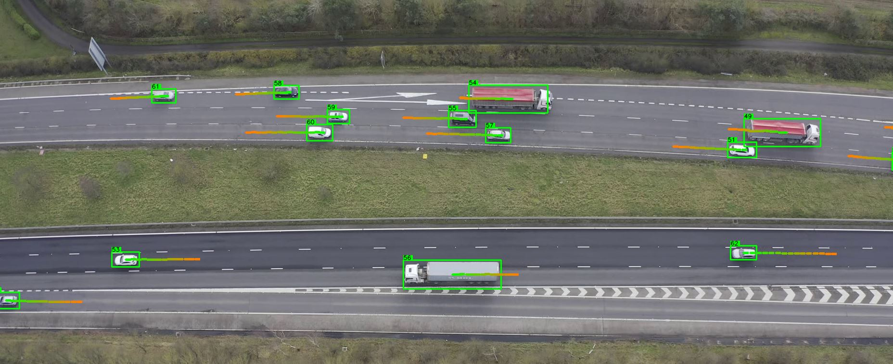

# Drone Data Processing

This is a collection of python scripts used to extract trajectories from aerial drone videos of vehicles. Developed for vehicles driving on the M40 at Junction 15 however, it should be general enough to be used on all vehicles that are orientated horizontally in frame. It could also be adapted for any aerial videos of vehicles

## Requirements

The conda env file is included in the repo.

Object detection is done through YoloV3. To install the darknet framework for Yolo follow this link: [darknet](https://github.com/AlexeyAB/darknet)

## Usage
In order to process a video file, follow this procedure:

Step 1: Use Yolov3_detection.py to perform object detection and produce detections.csv.

Step 2: Use centroid_tracking.py to track objects and produce tracked.csv.

Step 3: Use kalman_filtering.py to smooth trjectories and produce filtered.csv. (This doesn't work properly yet)

Step 4: Use visualise_vehicles.py to visualise the results at any stage.

Step 5: Use manual_correction_tool.py to correct false and missed trajectories. (doesn't work perfectly yet, new trajectory tracking has an issue)

